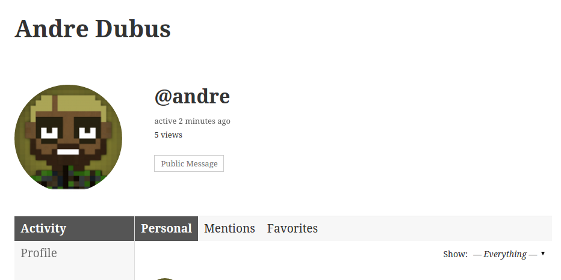
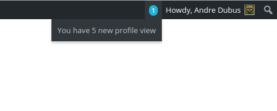
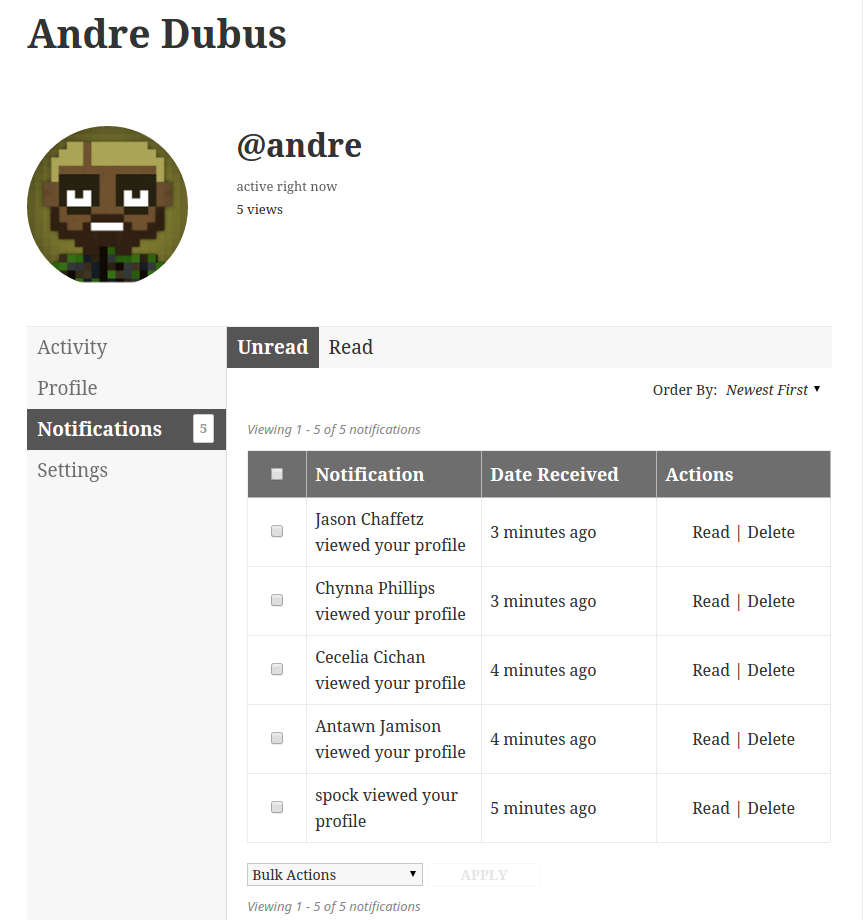
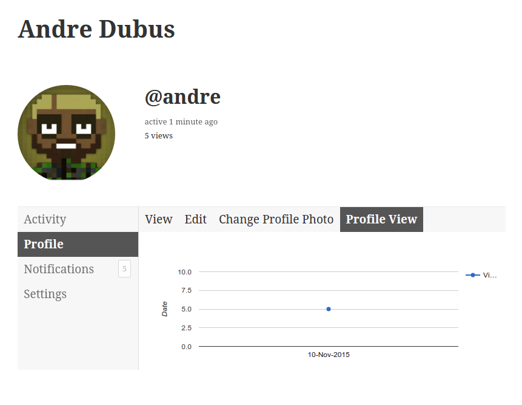

<!-- DO NOT EDIT THIS FILE; it is auto-generated from readme.txt -->
# Plugin Name

Show profile view count for the buddypress user similar to linkedin.

**Contributors:** [littlemonks](https://profiles.wordpress.org/littlemonks), [dipesh.kakadiya](https://profiles.wordpress.org/dipesh.kakadiya), [mehulkaklotar](https://profiles.wordpress.org/mehulkaklotar), [pareshradadiya](https://profiles.wordpress.org/pareshradadiya), [utkarshpatel](https://profiles.wordpress.org/utkarshpatel)  
**Tags:** [BuddyPress](https://wordpress.org/plugins/tags/BuddyPress), [Profile](https://wordpress.org/plugins/tags/Profile), [Count](https://wordpress.org/plugins/tags/Count), [Views](https://wordpress.org/plugins/tags/Views), [Views Count](https://wordpress.org/plugins/tags/Views Count), [BuddyPress Profile Views](https://wordpress.org/plugins/tags/BuddyPress Profile Views), [Profile Views](https://wordpress.org/plugins/tags/Profile Views), [Buddy Views](https://wordpress.org/plugins/tags/Buddy Views)  
**Requires at least:** 4.0  
**Tested up to:** 4.3  
**Stable tag:** 1.0.1  
**License:** [GPLv2 or later](http://www.gnu.org/licenses/gpl-2.0.html)  

## Description ##

A buddypress plugin that shows profile view count for the buddypress user similar to linkedin.
### Contributing to Buddy Views ###
If you have a patch, or stumbled upon an issue with Buddy Views, you can contribute this back to the code. Submit your pull request or issue on [Github buddy-views](https://github.com/LittleMonks/buddy-views/)

## Installation ##

### From your WordPress dashboard ###
1. Visit 'Plugins > Add New'
2. Search for 'Buddy Views'
3. Activate Buddy Views from your Plugins page.

### From WordPress.org ###
1. Download Buddy Views.
2. Upload the 'buddy-views' directory to your '/wp-content/plugins/' directory, using your favorite method (ftp, sftp, scp, etc...)
3. Activate Buddy Views from your Plugins page.

## Frequently Asked Questions ##

### Will it just show profile counts?  ###
No. It will also show who viewed your profile and graph of your profile view.

## Screenshots ##

### Showing profile views just like google plus

### Showing notifications of profile view

### Listing notification

### Profile view graph

## Changelog ##

### 1.0.1 ###
* Show profile views on member page
* Send notifications of profile view
* Profile view graph
* Screenshots and icons added

### 1.0.0 ###
* Initial beta release

